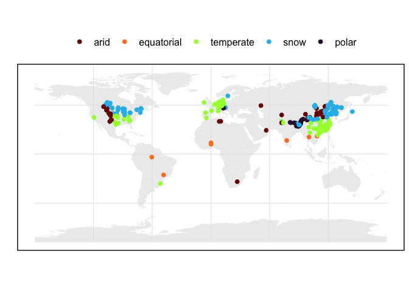
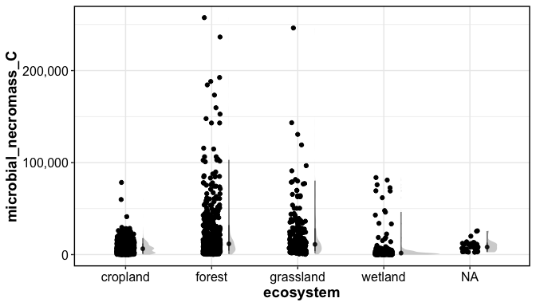
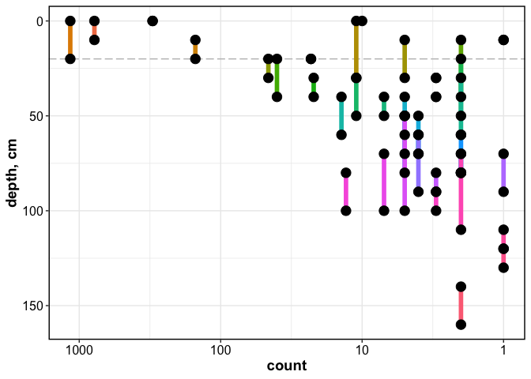

Necromass Database: Exploration
================

------------------------------------------------------------------------

### Geographical Distribution

<!-- -->

### Distribution by MAT-MAP

<!-- -->

### Distribution by Whittaker Biome

<!-- -->

### Distribution by ecosystem

<!-- -->

### Sample numbers summary

#### Sample count by biome

| ClimateTypes |    n |
|:-------------|-----:|
| arid         |  137 |
| equatorial   |   73 |
| polar        |   79 |
| snow         | 1317 |
| temperate    | 1132 |
| NA           |   53 |

#### Sample count by ecosystem

| ecosystem |    n |
|:----------|-----:|
| cropland  | 1466 |
| forest    |  609 |
| grassland |  283 |
| wetland   |  418 |
| NA        |   15 |

#### Sample count by depth

<!-- -->

of the 3000+ datapoints, 2512 data points are in the top 20 cm
(lyrbot_cm \>= 20)

<!-- -->

------------------------------------------------------------------------

Session Info

Date run: 2024-02-02

    ## R version 4.2.1 (2022-06-23)
    ## Platform: x86_64-apple-darwin17.0 (64-bit)
    ## Running under: macOS Big Sur ... 10.16
    ## 
    ## Matrix products: default
    ## BLAS:   /Library/Frameworks/R.framework/Versions/4.2/Resources/lib/libRblas.0.dylib
    ## LAPACK: /Library/Frameworks/R.framework/Versions/4.2/Resources/lib/libRlapack.dylib
    ## 
    ## locale:
    ## [1] en_US.UTF-8/en_US.UTF-8/en_US.UTF-8/C/en_US.UTF-8/en_US.UTF-8
    ## 
    ## attached base packages:
    ## [1] stats     graphics  grDevices utils     datasets  methods   base     
    ## 
    ## other attached packages:
    ##  [1] scales_1.2.1            rnaturalearthdata_0.1.0 rnaturalearth_0.1.0    
    ##  [4] sf_1.0-8                maptools_1.1-4          sp_1.5-0               
    ##  [7] plotbiomes_0.0.0.9001   googlesheets4_1.0.1     lubridate_1.9.2        
    ## [10] forcats_1.0.0           stringr_1.5.0           dplyr_1.1.0            
    ## [13] purrr_1.0.1             readr_2.1.4             tidyr_1.3.0            
    ## [16] tibble_3.1.8            ggplot2_3.4.3           tidyverse_2.0.0        
    ## 
    ## loaded via a namespace (and not attached):
    ##  [1] viridisLite_0.4.1    distributional_0.3.1 highr_0.9           
    ##  [4] stats4_4.2.1         ggdist_3.2.0         base64url_1.4       
    ##  [7] cellranger_1.1.0     yaml_2.3.5           pillar_1.8.1        
    ## [10] backports_1.4.1      lattice_0.20-45      glue_1.6.2          
    ## [13] digest_0.6.29        colorspace_2.0-3     htmltools_0.5.3     
    ## [16] pkgconfig_2.0.3      raster_3.6-23        s2_1.1.0            
    ## [19] webshot_0.5.4        processx_3.7.0       terra_1.7-46        
    ## [22] satellite_1.0.4      tzdb_0.3.0           timechange_0.2.0    
    ## [25] proxy_0.4-27         googledrive_2.0.0    farver_2.1.1        
    ## [28] generics_0.1.3       ellipsis_0.3.2       withr_2.5.0         
    ## [31] cli_3.6.0            mapview_2.11.0       readxl_1.4.2        
    ## [34] magrittr_2.0.3       ps_1.7.1             evaluate_0.16       
    ## [37] fs_1.5.2             fansi_1.0.3          foreign_0.8-82      
    ## [40] class_7.3-20         tools_4.2.1          data.table_1.14.4   
    ## [43] hms_1.1.2            gargle_1.2.0         lifecycle_1.0.3     
    ## [46] munsell_0.5.0        targets_0.14.0       callr_3.7.2         
    ## [49] compiler_4.2.1       e1071_1.7-11         rlang_1.1.1         
    ## [52] classInt_0.4-7       units_0.8-0          grid_4.2.1          
    ## [55] rstudioapi_0.14      htmlwidgets_1.5.4    igraph_1.3.4        
    ## [58] crosstalk_1.2.0      labeling_0.4.2       leafem_0.2.0        
    ## [61] base64enc_0.1-3      rmarkdown_2.21       wk_0.6.0            
    ## [64] gtable_0.3.0         codetools_0.2-18     DBI_1.1.3           
    ## [67] R6_2.5.1             knitr_1.42           fastmap_1.1.0       
    ## [70] utf8_1.2.2           KernSmooth_2.23-20   stringi_1.7.8       
    ## [73] Rcpp_1.0.11          vctrs_0.5.2          png_0.1-7           
    ## [76] leaflet_2.2.0        tidyselect_1.2.0     xfun_0.37

