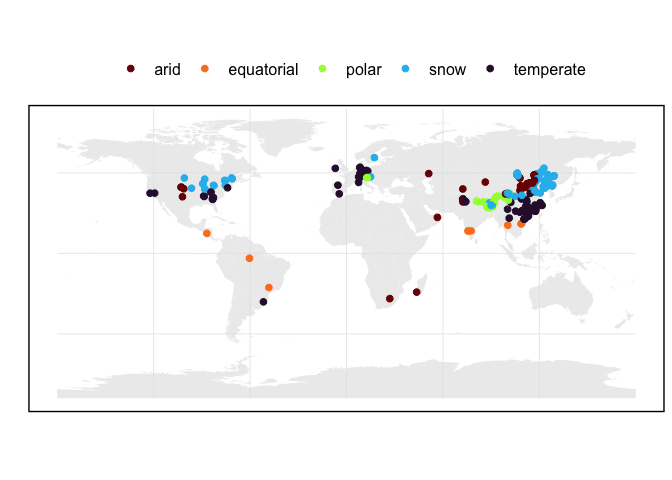
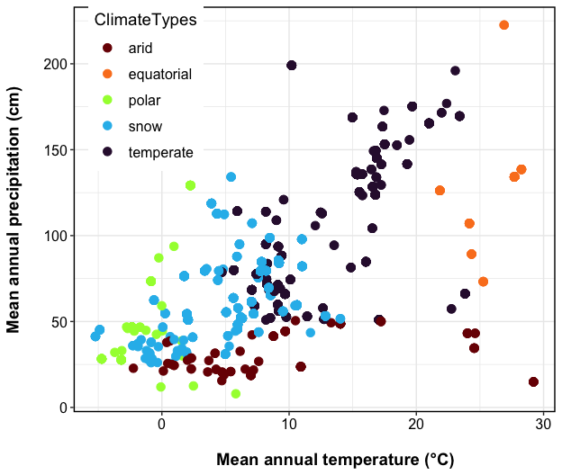
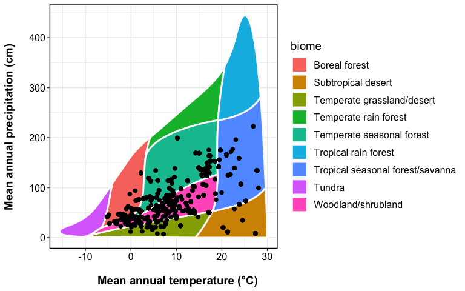
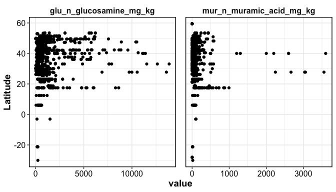
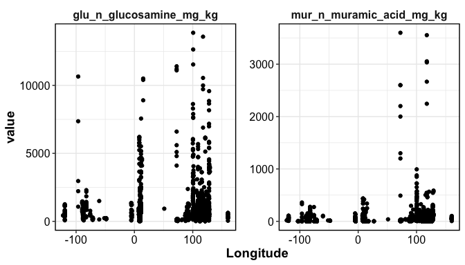
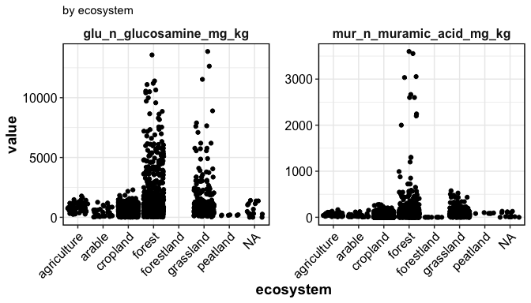
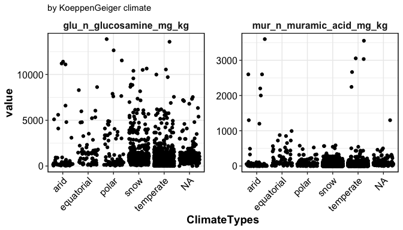

Necromass Database: Exploration
================

------------------------------------------------------------------------

### Geographical Distribution

<!-- -->

### Distribution by MAT-MAP

<!-- -->

### Distribution by Whittaker Biome

<!-- -->

### Distribution by lat-lon

<!-- --><!-- -->

### Distribution by other factors

<!-- --><!-- -->

------------------------------------------------------------------------

Session Info

Date run: 2023-09-12

    ## R version 4.2.1 (2022-06-23)
    ## Platform: x86_64-apple-darwin17.0 (64-bit)
    ## Running under: macOS Big Sur ... 10.16
    ## 
    ## Matrix products: default
    ## BLAS:   /Library/Frameworks/R.framework/Versions/4.2/Resources/lib/libRblas.0.dylib
    ## LAPACK: /Library/Frameworks/R.framework/Versions/4.2/Resources/lib/libRlapack.dylib
    ## 
    ## locale:
    ## [1] en_US.UTF-8/en_US.UTF-8/en_US.UTF-8/C/en_US.UTF-8/en_US.UTF-8
    ## 
    ## attached base packages:
    ## [1] stats     graphics  grDevices utils     datasets  methods   base     
    ## 
    ## other attached packages:
    ##  [1] sf_1.0-8                rnaturalearthdata_0.1.0 rnaturalearth_0.1.0    
    ##  [4] plotbiomes_0.0.0.9001   googlesheets4_1.0.1     lubridate_1.9.2        
    ##  [7] forcats_1.0.0           stringr_1.5.0           dplyr_1.1.0            
    ## [10] purrr_1.0.1             readr_2.1.4             tidyr_1.3.0            
    ## [13] tibble_3.1.8            ggplot2_3.4.0           tidyverse_2.0.0        
    ## [16] tarchetypes_0.7.2       targets_0.14.0         
    ## 
    ## loaded via a namespace (and not attached):
    ##  [1] viridisLite_0.4.1  highr_0.9          sp_1.5-0           stats4_4.2.1      
    ##  [5] base64url_1.4      cellranger_1.1.0   yaml_2.3.5         pillar_1.8.1      
    ##  [9] backports_1.4.1    lattice_0.20-45    glue_1.6.2         digest_0.6.29     
    ## [13] colorspace_2.0-3   htmltools_0.5.3    pkgconfig_2.0.3    raster_3.6-23     
    ## [17] s2_1.1.0           scales_1.2.1       webshot_0.5.4      processx_3.7.0    
    ## [21] terra_1.7-46       satellite_1.0.4    tzdb_0.3.0         timechange_0.2.0  
    ## [25] proxy_0.4-27       googledrive_2.0.0  farver_2.1.1       generics_0.1.3    
    ## [29] ellipsis_0.3.2     withr_2.5.0        cli_3.6.0          mapview_2.11.0    
    ## [33] magrittr_2.0.3     evaluate_0.16      ps_1.7.1           fs_1.5.2          
    ## [37] fansi_1.0.3        class_7.3-20       tools_4.2.1        data.table_1.14.4 
    ## [41] hms_1.1.2          gargle_1.2.0       lifecycle_1.0.3    munsell_0.5.0     
    ## [45] callr_3.7.2        compiler_4.2.1     e1071_1.7-11       rlang_1.0.6       
    ## [49] classInt_0.4-7     units_0.8-0        grid_4.2.1         rstudioapi_0.14   
    ## [53] htmlwidgets_1.5.4  crosstalk_1.2.0    igraph_1.3.4       labeling_0.4.2    
    ## [57] leafem_0.2.0       base64enc_0.1-3    rmarkdown_2.21     wk_0.6.0          
    ## [61] gtable_0.3.0       codetools_0.2-18   DBI_1.1.3          R6_2.5.1          
    ## [65] knitr_1.42         fastmap_1.1.0      utf8_1.2.2         KernSmooth_2.23-20
    ## [69] stringi_1.7.8      Rcpp_1.0.11        vctrs_0.5.2        png_0.1-7         
    ## [73] leaflet_2.2.0      tidyselect_1.2.0   xfun_0.37

