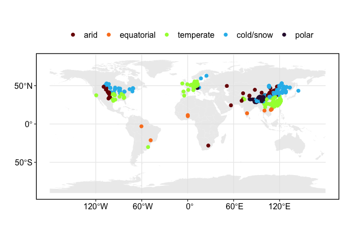
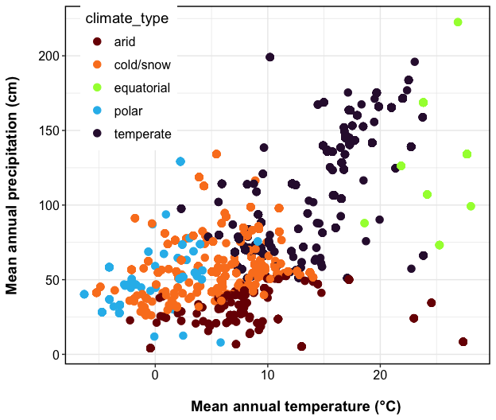
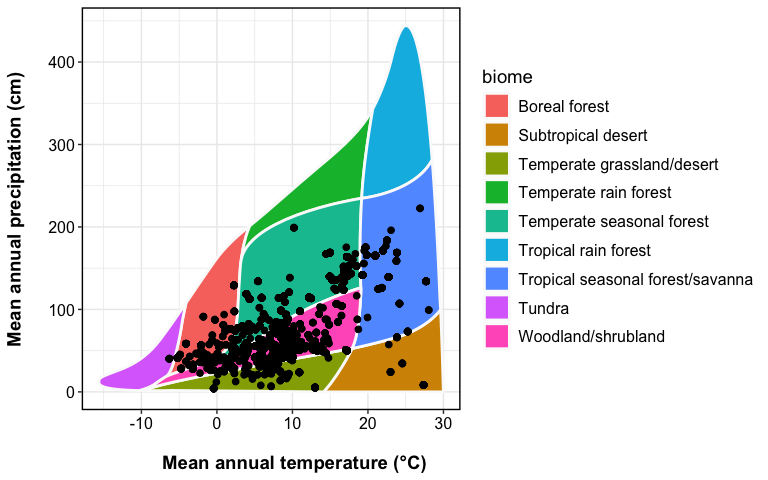
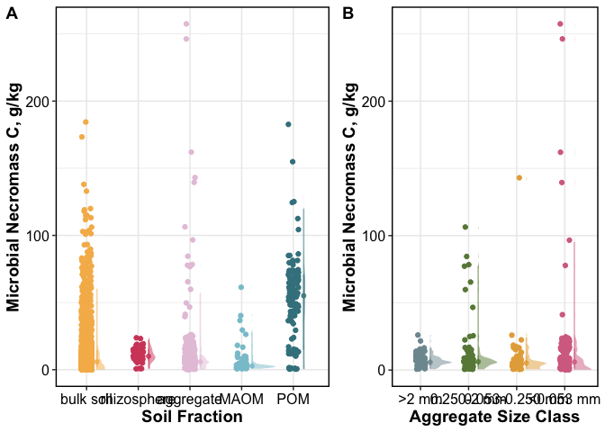
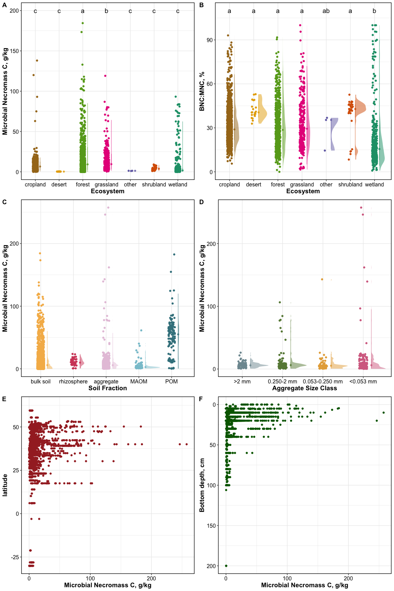
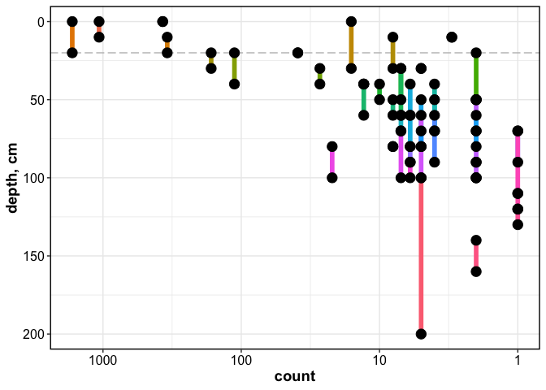
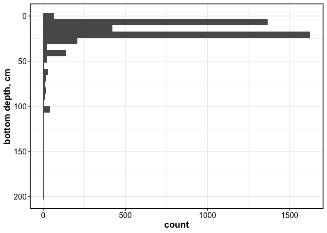

Necromass Database: Exploration
================

------------------------------------------------------------------------

## FIGURES

### Geographical Distribution

<!-- -->

### Distribution by MAT-MAP

<!-- -->

### Distribution by Whittaker Biome

<!-- -->

### Distribution by ecosystem

## fractions

    ##   fraction_scheme
    ## 1       bulk soil
    ## 2       aggregate
    ## 3     rhizosphere
    ## 4            <NA>
    ## 5            MAOM
    ## 6             POM

    ##    aggregate_size
    ## 1            <NA>
    ## 2       0.250-2mm
    ## 3        <0.250mm
    ## 4    0.002-0.02mm
    ## 5        <0.002mm
    ## 6   0.020-0.250mm
    ## 7            >2mm
    ## 8   0.053-0.250mm
    ## 9        <0.053mm
    ## 10  0.002-0.020mm
    ## 11  0.063-0.250mm
    ## 12  0.002-0.250mm
    ## 13       <0.005mm
    ## 14      2-0.250mm
    ## 15  0.250-0.053mm
    ## 16           >1mm
    ## 17      0.250-1mm
    ## 18  0.020-0.002mm
    ## 19       <0.020mm
    ## 20          1-2mm
    ## 21      0.053-8mm
    ## 22       >0.020mm
    ## 23      0.250-3mm
    ## 24      0.250-4mm
    ## 25      0.250-5mm
    ## 26       >0.250mm
    ## 27      0.053-2mm
    ## 28  0.002-0.053mm
    ## 29           >3mm
    ## 30           >4mm
    ## 31           >5mm
    ## 32           >6mm
    ## 33           >7mm

<!-- -->

<!-- -->

#### Sample count by depth

<!-- -->

of the 4000+ datapoints, 3454 data points are in the top 20 cm (lyr_btm
\>= 20)

<!-- -->

## TABLES

### Sample count by biome

| climate_type |    n |
|:-------------|-----:|
| arid         |  275 |
| cold/snow    | 1607 |
| equatorial   |   94 |
| polar        |  153 |
| temperate    | 1747 |
| NA           |  209 |

### Sample count by ecosystem

| ecosystem |    n |
|:----------|-----:|
| cropland  | 1731 |
| desert    |   26 |
| forest    | 1065 |
| grassland |  349 |
| other     |   51 |
| shrubland |   33 |
| wetland   |  585 |
| NA        |  245 |

### total counts

    ## [1] "Number of records"

    ##      n
    ## 1 4085

    ## [1] "Number of studies"

    ##     n
    ## 1 228

------------------------------------------------------------------------

Session Info

Date run: 2026-09-03

    ## R version 4.5.0 (2025-04-11)
    ## Platform: aarch64-apple-darwin20
    ## Running under: macOS 26.6.2
    ## 
    ## Matrix products: default
    ## BLAS:   /Library/Frameworks/R.framework/Versions/4.5-arm64/Resources/lib/libRblas.0.dylib 
    ## LAPACK: /Library/Frameworks/R.framework/Versions/4.5-arm64/Resources/lib/libRlapack.dylib;  LAPACK version 3.12.1
    ## 
    ## locale:
    ## [1] en_US.UTF-8/en_US.UTF-8/en_US.UTF-8/C/en_US.UTF-8/en_US.UTF-8
    ## 
    ## time zone: America/Los_Angeles
    ## tzcode source: internal
    ## 
    ## attached base packages:
    ## [1] stats     graphics  grDevices datasets  utils     methods   base     
    ## 
    ## other attached packages:
    ##  [1] scales_1.4.0            rnaturalearthdata_1.0.0 rnaturalearth_1.0.1    
    ##  [4] sf_1.0-21               plotbiomes_0.0.0.9001   googlesheets4_1.1.1    
    ##  [7] lubridate_1.9.4         forcats_1.0.0           stringr_1.5.1          
    ## [10] dplyr_1.2.0             purrr_1.0.4             readr_2.1.5            
    ## [13] tidyr_1.3.2             tibble_3.3.1            ggplot2_4.0.2          
    ## [16] tidyverse_2.0.0        
    ## 
    ## loaded via a namespace (and not attached):
    ##  [1] tidyselect_1.2.1     viridisLite_0.4.2    farver_2.1.2        
    ##  [4] S7_0.2.0             fastmap_1.2.0        leaflet_2.2.3       
    ##  [7] mapview_2.11.4       digest_0.6.37        timechange_0.3.0    
    ## [10] lifecycle_1.0.5      cluster_2.1.8.1      terra_1.8-50        
    ## [13] magrittr_2.0.3       compiler_4.5.0       rlang_1.1.7         
    ## [16] tools_4.5.0          yaml_2.3.10          data.table_1.17.0   
    ## [19] knitr_1.50           labeling_0.4.3       htmlwidgets_1.6.4   
    ## [22] sp_2.2-0             classInt_0.4-11      RColorBrewer_1.1-3  
    ## [25] KernSmooth_2.23-26   withr_3.0.2          grid_4.5.0          
    ## [28] stats4_4.5.0         googledrive_2.1.1    AlgDesign_1.2.1.2   
    ## [31] e1071_1.7-16         leafem_0.2.5         MASS_7.3-65         
    ## [34] cli_3.6.5            rmarkdown_2.29       generics_0.1.3      
    ## [37] rstudioapi_0.17.1    httr_1.4.7           tzdb_0.5.0          
    ## [40] readxl_1.4.5         DBI_1.2.3            proxy_0.4-27        
    ## [43] cellranger_1.1.0     base64enc_0.1-3      vctrs_0.7.1         
    ## [46] jsonlite_2.0.0       whistledown_0.1.0    hms_1.1.3           
    ## [49] crosstalk_1.2.1      ggdist_3.3.3         units_0.8-7         
    ## [52] glue_1.8.0           codetools_0.2-20     cowplot_1.1.3       
    ## [55] distributional_0.5.0 stringi_1.8.7        gtable_0.3.6        
    ## [58] raster_3.6-32        pillar_1.10.2        htmltools_0.5.8.1   
    ## [61] satellite_1.0.6      R6_2.6.1             evaluate_1.0.3      
    ## [64] lattice_0.22-6       png_0.1-8            gargle_1.5.2        
    ## [67] agricolae_1.3-7      renv_1.1.7           class_7.3-23        
    ## [70] Rcpp_1.1.1           nlme_3.1-168         xfun_0.53           
    ## [73] fs_1.6.6             pkgconfig_2.0.3

