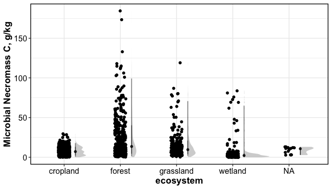
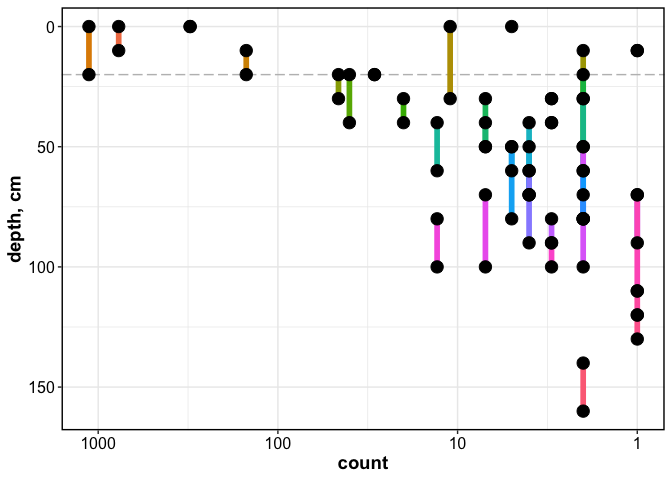

Necromass Database: Exploration
================

------------------------------------------------------------------------

### Geographical Distribution

<!-- -->

### Distribution by MAT-MAP

<!-- -->

### Distribution by Whittaker Biome

<!-- -->

### Distribution by ecosystem

<!-- -->

### Sample numbers summary

#### Sample count by biome

| ClimateTypes |    n |
|:-------------|-----:|
| arid         |  108 |
| equatorial   |   81 |
| polar        |   93 |
| snow         | 1310 |
| temperate    | 1380 |
| NA           |   58 |

#### Sample count by ecosystem

| ecosystem |    n |
|:----------|-----:|
| cropland  | 1627 |
| forest    |  679 |
| grassland |  272 |
| wetland   |  422 |
| NA        |   30 |

#### Sample count by depth

<!-- -->

of the 3000+ datapoints, 2512 data points are in the top 20 cm
(lyrbot_cm \>= 20)

------------------------------------------------------------------------

Session Info

Date run: 2024-01-09

    ## R version 4.2.1 (2022-06-23)
    ## Platform: x86_64-apple-darwin17.0 (64-bit)
    ## Running under: macOS Big Sur ... 10.16
    ## 
    ## Matrix products: default
    ## BLAS:   /Library/Frameworks/R.framework/Versions/4.2/Resources/lib/libRblas.0.dylib
    ## LAPACK: /Library/Frameworks/R.framework/Versions/4.2/Resources/lib/libRlapack.dylib
    ## 
    ## locale:
    ## [1] en_US.UTF-8/en_US.UTF-8/en_US.UTF-8/C/en_US.UTF-8/en_US.UTF-8
    ## 
    ## attached base packages:
    ## [1] stats     graphics  grDevices utils     datasets  methods   base     
    ## 
    ## other attached packages:
    ##  [1] scales_1.2.1            rnaturalearthdata_0.1.0 rnaturalearth_0.1.0    
    ##  [4] sf_1.0-8                maptools_1.1-4          sp_1.5-0               
    ##  [7] plotbiomes_0.0.0.9001   googlesheets4_1.0.1     lubridate_1.9.2        
    ## [10] forcats_1.0.0           stringr_1.5.0           dplyr_1.1.0            
    ## [13] purrr_1.0.1             readr_2.1.4             tidyr_1.3.0            
    ## [16] tibble_3.1.8            ggplot2_3.4.3           tidyverse_2.0.0        
    ## [19] tarchetypes_0.7.2       targets_0.14.0         
    ## 
    ## loaded via a namespace (and not attached):
    ##  [1] fs_1.5.2             satellite_1.0.4      webshot_0.5.4       
    ##  [4] httr_1.4.4           mapview_2.11.0       tools_4.2.1         
    ##  [7] backports_1.4.1      utf8_1.2.2           R6_2.5.1            
    ## [10] KernSmooth_2.23-20   ggdist_3.2.0         DBI_1.1.3           
    ## [13] colorspace_2.0-3     raster_3.6-23        withr_2.5.0         
    ## [16] tidyselect_1.2.0     processx_3.7.0       leaflet_2.2.0       
    ## [19] curl_4.3.2           compiler_4.2.1       leafem_0.2.0        
    ## [22] cli_3.6.0            labeling_0.4.2       classInt_0.4-7      
    ## [25] callr_3.7.2          proxy_0.4-27         askpass_1.1         
    ## [28] rappdirs_0.3.3       digest_0.6.29        foreign_0.8-82      
    ## [31] rmarkdown_2.21       base64enc_0.1-3      pkgconfig_2.0.3     
    ## [34] htmltools_0.5.3      highr_0.9            fastmap_1.1.0       
    ## [37] htmlwidgets_1.5.4    rlang_1.1.1          readxl_1.4.2        
    ## [40] rstudioapi_0.14      farver_2.1.1         generics_0.1.3      
    ## [43] jsonlite_1.8.4       crosstalk_1.2.0      distributional_0.3.1
    ## [46] magrittr_2.0.3       s2_1.1.0             Rcpp_1.0.11         
    ## [49] munsell_0.5.0        fansi_1.0.3          lifecycle_1.0.3     
    ## [52] terra_1.7-46         stringi_1.7.8        yaml_2.3.5          
    ## [55] grid_4.2.1           lattice_0.20-45      hms_1.1.2           
    ## [58] knitr_1.42           ps_1.7.1             pillar_1.8.1        
    ## [61] igraph_1.3.4         base64url_1.4        codetools_0.2-18    
    ## [64] stats4_4.2.1         wk_0.6.0             glue_1.6.2          
    ## [67] evaluate_0.16        data.table_1.14.4    png_0.1-7           
    ## [70] vctrs_0.5.2          tzdb_0.3.0           cellranger_1.1.0    
    ## [73] gtable_0.3.0         openssl_2.0.2        xfun_0.37           
    ## [76] e1071_1.7-11         class_7.3-20         googledrive_2.0.0   
    ## [79] viridisLite_0.4.1    gargle_1.2.0         units_0.8-0         
    ## [82] timechange_0.2.0     ellipsis_0.3.2

