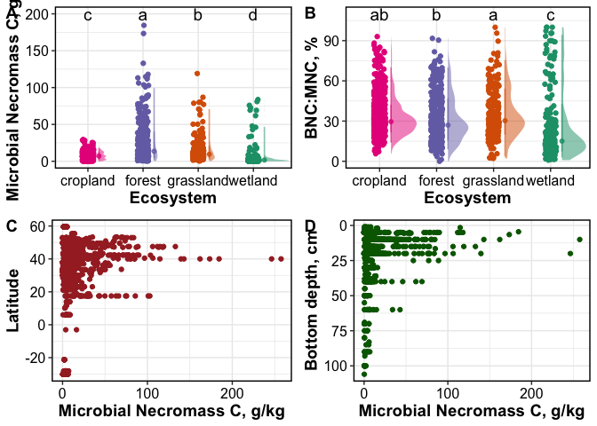

Necromass Database: Exploration
================

------------------------------------------------------------------------

## FIGURES

### Geographical Distribution

<!-- -->

### Distribution by MAT-MAP

<!-- -->

### Distribution by Whittaker Biome

<!-- -->

### Distribution by ecosystem

<!-- -->

#### Sample count by depth

<!-- -->

of the 3000+ datapoints, 2512 data points are in the top 20 cm
(lyrbot_cm \>= 20)

<!-- -->

## TABLES

### Sample count by biome

| ClimateTypes |    n |
|:-------------|-----:|
| arid         |  137 |
| equatorial   |   69 |
| polar        |   67 |
| snow         | 1305 |
| temperate    | 1082 |
| NA           |   53 |

### Sample count by ecosystem

| ecosystem |    n |
|:----------|-----:|
| cropland  | 1453 |
| forest    |  555 |
| grassland |  272 |
| wetland   |  418 |
| NA        |   15 |

------------------------------------------------------------------------

Session Info

Date run: 2024-07-16

    ## R version 4.2.1 (2022-06-23)
    ## Platform: x86_64-apple-darwin17.0 (64-bit)
    ## Running under: macOS Big Sur ... 10.16
    ## 
    ## Matrix products: default
    ## BLAS:   /Library/Frameworks/R.framework/Versions/4.2/Resources/lib/libRblas.0.dylib
    ## LAPACK: /Library/Frameworks/R.framework/Versions/4.2/Resources/lib/libRlapack.dylib
    ## 
    ## locale:
    ## [1] en_US.UTF-8/en_US.UTF-8/en_US.UTF-8/C/en_US.UTF-8/en_US.UTF-8
    ## 
    ## attached base packages:
    ## [1] stats     graphics  grDevices utils     datasets  methods   base     
    ## 
    ## other attached packages:
    ##  [1] scales_1.2.1            rnaturalearthdata_0.1.0 rnaturalearth_0.1.0    
    ##  [4] sf_1.0-8                maptools_1.1-4          sp_1.5-0               
    ##  [7] plotbiomes_0.0.0.9001   googlesheets4_1.0.1     lubridate_1.9.2        
    ## [10] forcats_1.0.0           stringr_1.5.0           dplyr_1.1.0            
    ## [13] purrr_1.0.1             readr_2.1.4             tidyr_1.3.0            
    ## [16] tibble_3.1.8            ggplot2_3.4.3           tidyverse_2.0.0        
    ## 
    ## loaded via a namespace (and not attached):
    ##  [1] googledrive_2.0.0    leafem_0.2.0         colorspace_2.0-3    
    ##  [4] ellipsis_0.3.2       class_7.3-20         leaflet_2.2.0       
    ##  [7] satellite_1.0.4      base64enc_0.1-3      fs_1.5.2            
    ## [10] rstudioapi_0.14      proxy_0.4-27         farver_2.1.1        
    ## [13] fansi_1.0.3          codetools_0.2-18     knitr_1.42          
    ## [16] cluster_2.1.3        png_0.1-7            targets_0.14.0      
    ## [19] ggdist_3.2.0         shiny_1.7.2          compiler_4.2.1      
    ## [22] backports_1.4.1      mapview_2.11.0       fastmap_1.1.0       
    ## [25] gargle_1.2.0         cli_3.6.0            later_1.3.0         
    ## [28] s2_1.1.0             htmltools_0.5.7      tools_4.2.1         
    ## [31] igraph_1.5.1         gtable_0.3.0         agricolae_1.3-5     
    ## [34] glue_1.6.2           wk_0.6.0             Rcpp_1.0.11         
    ## [37] cellranger_1.1.0     raster_3.6-23        vctrs_0.5.2         
    ## [40] nlme_3.1-160         crosstalk_1.2.0      xfun_0.42           
    ## [43] ps_1.7.1             timechange_0.2.0     mime_0.12           
    ## [46] miniUI_0.1.1.1       lifecycle_1.0.3      terra_1.7-46        
    ## [49] MASS_7.3-60          hms_1.1.2            promises_1.2.0.1    
    ## [52] RColorBrewer_1.1-3   yaml_2.3.5           labelled_2.10.0     
    ## [55] stringi_1.7.8        highr_0.9            klaR_1.7-1          
    ## [58] AlgDesign_1.2.1      e1071_1.7-11         rlang_1.1.1         
    ## [61] pkgconfig_2.0.3      distributional_0.3.1 evaluate_0.16       
    ## [64] lattice_0.20-45      htmlwidgets_1.6.4    labeling_0.4.2      
    ## [67] cowplot_1.1.1        processx_3.7.0       tidyselect_1.2.0    
    ## [70] magrittr_2.0.3       R6_2.5.1             generics_0.1.3      
    ## [73] base64url_1.4        combinat_0.0-8       DBI_1.1.3           
    ## [76] pillar_1.8.1         haven_2.5.1          foreign_0.8-82      
    ## [79] withr_2.5.0          units_0.8-0          questionr_0.7.7     
    ## [82] KernSmooth_2.23-20   utf8_1.2.2           tzdb_0.3.0          
    ## [85] rmarkdown_2.21       grid_4.2.1           readxl_1.4.2        
    ## [88] data.table_1.14.4    callr_3.7.2          digest_0.6.29       
    ## [91] classInt_0.4-7       webshot_0.5.4        xtable_1.8-4        
    ## [94] httpuv_1.6.5         stats4_4.2.1         munsell_0.5.0       
    ## [97] viridisLite_0.4.1

